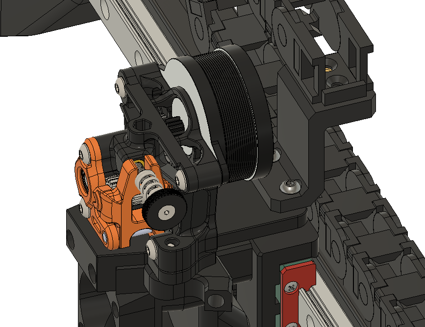

# Dirty Bird Cable Chain Mount

## Status

I've got this on my V2.4 350 mm, and it works well!

## How to

Print on its side, no supports. 3x M3 inserts and BHCS screws to hold the chain in place, and 2x M3x12 BHCS/SHCS to hold the mount to the X carriage.

Note I'm using the Mini Sherpa mount. You might need to adjust the height by 4 mm if you are not using this little adapter!
