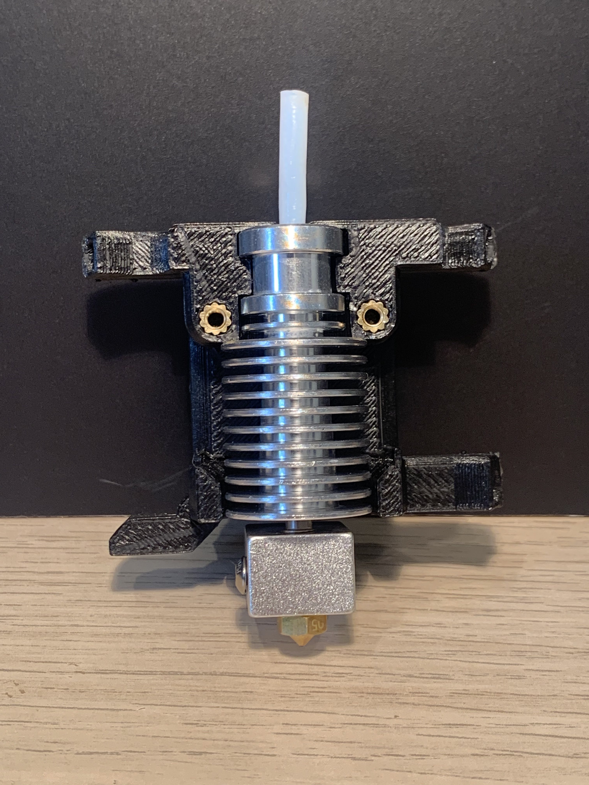

# Mod description

**Groovey Core**

Adds a new core to allow groove mount hotends to be mounted to the DB

# Status

Release

# Incompatibilities

Sherpa Micro

# Update notes

Compatible with Dragon/Crazy ducts.
Replace the top 2 hotend fan screws with 2 M3x35mm BHCS

# Instructions

**Print settings**

The STL is correctly oriented, do not change orientation

**Additional hardware**

2x M3x35 BHCS
