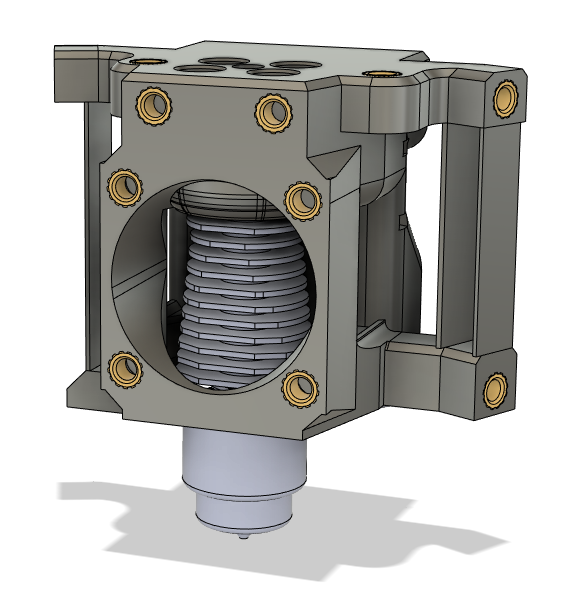

# Mod description

**Revo Core**

Adds a new core to allow Revo hotends to be mounted to the DB

# Status

Release

# Incompatibilities

None

# Update notes

Compatible with Dragon/Crazy ducts.

# Instructions

**Print settings**

The STL is correctly oriented, do not change orientation

**Additional hardware**

4x M3x8 SHCS
